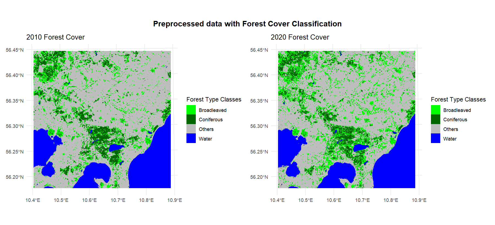
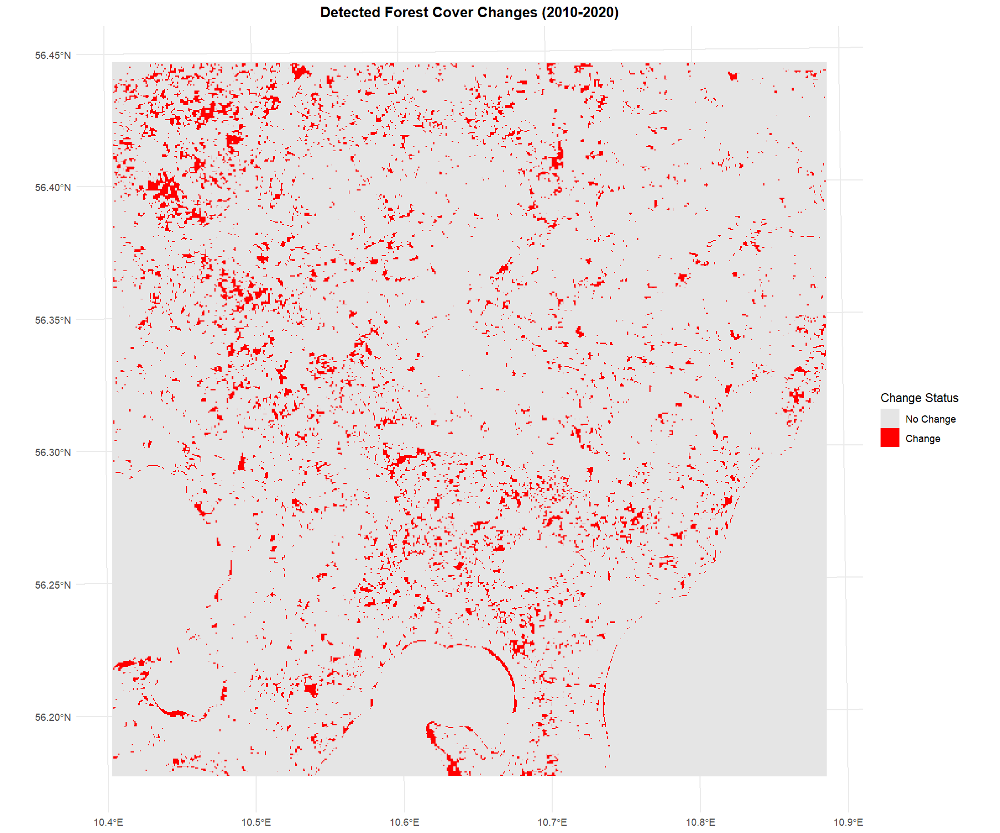

# chngTrackR 📈

chngTrackR is a lightweight R package designed for efficient change detection in raster data using a straightforward image differencing approach.

## Key area of applications:

The chngTrackR package can be used for spatial and temporal change detection using a simple and efficient image differencing approach. It supports a wide range of applications across environmental, urban, and disaster-related domains, including:

-   Forest and Land Cover Change
-   Urban Expansion and Sprawl
-   Mapping change in vegetation or land cover before/after disasters
-   Identifying shifts between agricultural and non-agricultural land

## Installation

The developed version of forchange can be installed from [GitHub](https://github.com/) with:

``` r
# install.packages("devtools")
devtools::install_github("ReznaGauro/chngTrackR")
```

## Main core functions:

-   `prep_rastdat`: Preprocesses rasters (align CRS, extent, resolution, radiometric correction, handle NAs).
-   `calc_diff`: Computes differences between rasters using methods like simple, absolute, normalized, or index-based.
-   `detect_change`: Detects changes via thresholding methods like Otsu, k-means, SD, percentile.
-   `postprocess_mask`: Applies morphological operations (closing, opening, clump) to clean the mask.
-   `validate_results`: Compares predicted mask with ground truth for accuracy metrics.

## Example: Forest Cover Change Detection (2010–2020)

Here is the example usage which demonstrates how to use chngTrackR to detect forest cover changes using classified raster data from two time periods.. This example showcases the forest cover change detection in Denmark (a region in the Baltic sea forest area). Data from the Landsat 5 and Landsat 8 sensors are used for two different time steps. For this example, Landsat 5 (2010) and Landsat 8 (2020) classifications are stored in the package:

-   X0063_Y0029_2010_Classification.tif: 2010 land cover classes (Broadleaved, Coniferous, Water, Others)

-   X0063_Y0029_2020_Classification.tif: 2020 classes

-   Combined_X0063_Y0029_2020_Validations.csv: Validation points

## Part 1: Loading the data

Note: In this example, since we use classified raster data, we load the rasters, assign class labels, and prepare the data before using other functions from the package

Here, we load embedded classified rasters (2010 and 2020) and validation data. Also, convert rasters to categorical layers with labels (Broadleaved, Coniferous, etc.) for interpretability.

```         
library(terra)
library(sf)
library(dplyr)
library(chngTrackR)
library(ggplot2)
library(patchwork)
library(ggspatial)
library(caret)
library(viridis)
library(tidyterra)
library(purrr)

# Use system.file to access included example data
before_path <- system.file("extdata", "X0063_Y0029_2010_Classification.tif", package = "chngTrackR")
after_path  <- system.file("extdata", "X0063_Y0029_2020_Classification.tif", package = "chngTrackR")
valid_path  <- system.file("extdata", "Combined_X0063_Y0029_2020_Validations.csv", package = "chngTrackR")

# Load raster and validation data
before <- rast(before_path)
after  <- rast(after_path)
valid_data <- read.csv(valid_path)

# Assign consistent layer names
names(before) <- names(after) <- "class"

# Define class labels
class_labels <- c("Broadleaved", "Coniferous", "Water", "Others")

# Convert rasters to factors with labels
before <- as.factor(before)
levels(before) <- data.frame(value = 1:4, label = class_labels)

after <- as.factor(after)
levels(after) <- data.frame(value = 1:4, label = class_labels)
```

## Part 2: Preprocess Raster Data

Using functions from the chngTrackR

-   prep_rastdat() to align and clean the rasters.
-   Align rasters to identical spatial properties (CRS, resolution, extent).
-   Ensures pixel-wise comparability. Uses resample_method = "near" to preserve categorical integrity.

```         
processed <- prep_rastdat(
  before = before,
  after = after,
  resample_method = "near",
  radiometric_method = "none",
  verbose = TRUE
) %>% map_if(is.factor, ~ {
  levels(.x) <- data.frame(ID = 1:4, label = class_labels)
  .x
})
```



(Note: This plot was generated using the ggplot2 package. The corresponding code is external and not included within the package's R scripts.)

## Part 3: Perform change detection

In this part, we use:

-   calc_diff to compute pixel-wise class transitions (method = "simple" flags any class change as 1).
-   detect_change() to apply a fixed threshold (0.5) to isolate significant changes.

```         
# Convert to numeric format
before_num <- as.numeric(processed$before)
after_num <- as.numeric(processed$after)

# Calculate differences
class_diff <- calc_diff(before_num, after_num, method = "simple")

# Detect changes using threshold
change_mask <- detect_change(class_diff, method = "fixed", threshold = 0.5) %>%
  setNames("change_status")
```

## Part 4: Post-Process change mask

postprocess_mask function cleans noise using morphological closing (3x3 kernel). Reclassify and label outputs. Removes isolated pixels and smooths edges for clearer change areas.Supports multiple operations (closing, opening) and kernel size

```         
clean_mask <- postprocess_mask(
  change_mask,
  operation = "closing",
  kernel_size = 3
) %>%
  classify(matrix(c(NA, 0), ncol = 2)) %>%
  as.factor() %>%
  {levels(.) <- data.frame(ID = 0:1, label = c("No Change", "Change")); .}

## Visualize the changes detected

change_plot <- ggplot() +
  geom_spatraster(data = clean_mask) +
  scale_fill_manual(
    values = c("No Change" = "gray90", "Change" = "red"),
    name = "Change Status",
    na.value = "transparent"
  ) +
  ggtitle("Detected Forest Cover Changes (2010–2020)") +
  theme_minimal() +
  theme(plot.title = element_text(hjust = 0.5, face = "bold"))

print(change_plot)
```



## Part 5: Validate with Ground Truth:

The final function validate_results Compares detected changes against ground truth points. Quantifies accuracy (91% overall accuracy, Kappa = 0.79). Works with rasterized validation data and outputs confusion matrices.

```         
# Prepare validation points
valid_data <- read.csv(valid_path) %>%
  rename(latitude = "Latitude", longitude = "Longitude", class = "Class") %>%
  st_as_sf(coords = c("longitude", "latitude"), crs = crs(before)) %>%
  mutate(change = case_when(
    class %in% c("Broadleaved", "Coniferous") ~ 0L,
    class == "Others" ~ 1L
  )) %>%
  select(change, geometry)

# Rasterize validation data
truth_mask <- rasterize(valid_data, clean_mask, field = "change", fun = "max", background = 0)
truth_mask <- mask(truth_mask, clean_mask)

# Convert to numeric
clean_mask_num <- as.numeric(clean_mask)
truth_mask_num <- as.numeric(truth_mask)

# Validate
validation <- validate_results(clean_mask_num, truth_mask_num)

# Print results
cat("Confusion Matrix:\n")
print(validation$confusion_matrix)
cat("\nOverall Accuracy:", round(validation$overall_accuracy, 3))
cat("\nKappa Coefficient:", round(validation$kappa, 3), "\n")


# Optional: Save output if needed
output_dir <- tempfile()
writeRaster(clean_mask, file.path(output_dir, "change_mask.tif"), overwrite = TRUE)
writeRaster(class_diff, file.path(output_dir, "class_diff.tif"), overwrite = TRUE)
```


## Outcomes:

Finally, you’ll get two output TIFFs: `changed_mask`, showing where changes occurred, and `class_transitioned`, detailing how classes shifted (e.g., broadleaved to coniferous). These are derived by comparing classified rasters from two years, allowing clear visualization and analysis of spatial change patterns.

For example:


(Note: This plot was generated using the ggplot2 package. The corresponding code is external and not included within the package's R scripts.)

## References:

-   Validation points were randomly extracted using EnMAP-Box 3 QGIS plugin <https://plugins.qgis.org/plugins/enmapboxplugin/>

## Suggestions for Users

Expand Data Sources: Test with Sentinel-2 or MODIS classifications.

Parameter Tuning: Use detect_change(method = "otsu") for automated thresholding.

Batch Processing: Loop workflows for multi-temporal analysis.

Custom Visualizations: Leverage ggplot2/tmap for tailored maps.

## Further Notes:

-   Stay tuned for updates with interactive maps and animated change timelines! 🌍🔍
-   I hope that you find chngTrackR package useful!
-   Also, there are many possible code improvements. Looking forward to any suggestions you might have!

## Acknowledgements:

This is a submission for the course 'Introduction to Programming and Statistics for Remote Sensing and GIS' as part of the M.Sc. EAGLE program at the University of Würzburg. Also, I express my immense thanks to Dr. Martin Wegmann for the support during the development of the package.
